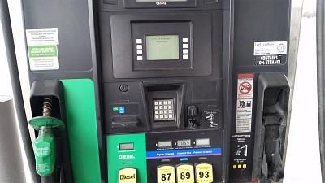

# Project: Gas Station Pump

## CS/SE 6329.001, Spring 2016

**Overview:** The application is a control system for a gas station pump. The software will control all aspects of the pump’s function: Validating the credit/debit card (if one is being used), allowing the customer to select the grade of gasoline, calculating and displaying the running total and amount of gas pumped, and presenting the total (including taxes) to the user.

The mechanism the controls the flow of the gas through the nozzle is assumed to be mechanical and is not controlled by this application; the application simply keeps track of the amount of gas that has been pumped. The pump will also print a receipt and log the sale following completion.

**Deliverables**: The following deliverables are required for this project. All deliverables will be submitted on eLearning before midnight of the date listed, with the exception of the in-class demos:

### Date & Deliverables

#### February 14
1. Domain Model
2. Use Case Diagram (UCD) with brief description for each use case
3. Prioritized list of Use Cases (UCs)

#### February 28
1. Updated Deliverables
2. Main UC in fully dressed format
3. Supplementary Specification

#### March 13
1. Updated Deliverables
2. System Sequence Diagram
3. Operation Contracts

#### April 10
1. Updated Deliverables
2. Logical Architecture
3. Use Case Realizations
4. Design Class Diagram

#### April 25 - 29
- Demo for TA
